# Retinal-AI System Architecture Diagrams

This document contains comprehensive architectural diagrams for the Retinal-AI platform, including data flow, flowcharts, entity relationships, UML diagrams, and system architecture visualizations.

---

## 1. System Architecture Overview

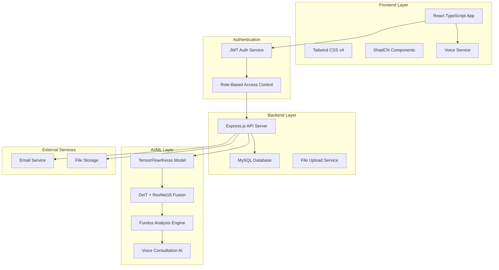

---

## 2. Data Flow Diagram

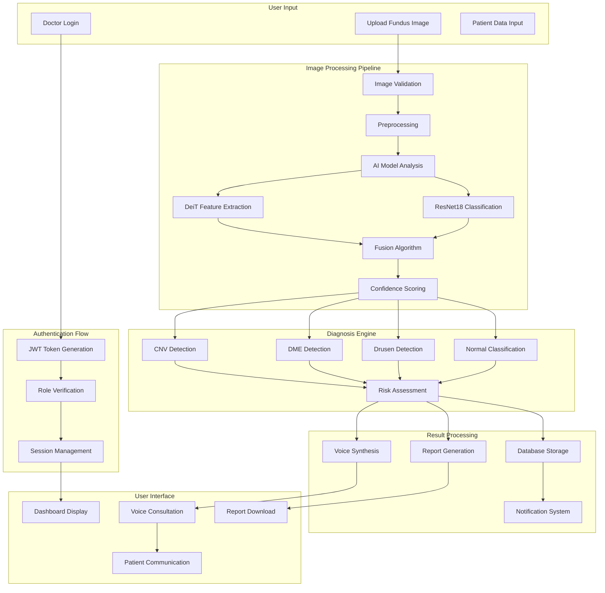

---

## 3. Entity Relationship (ER) Diagram

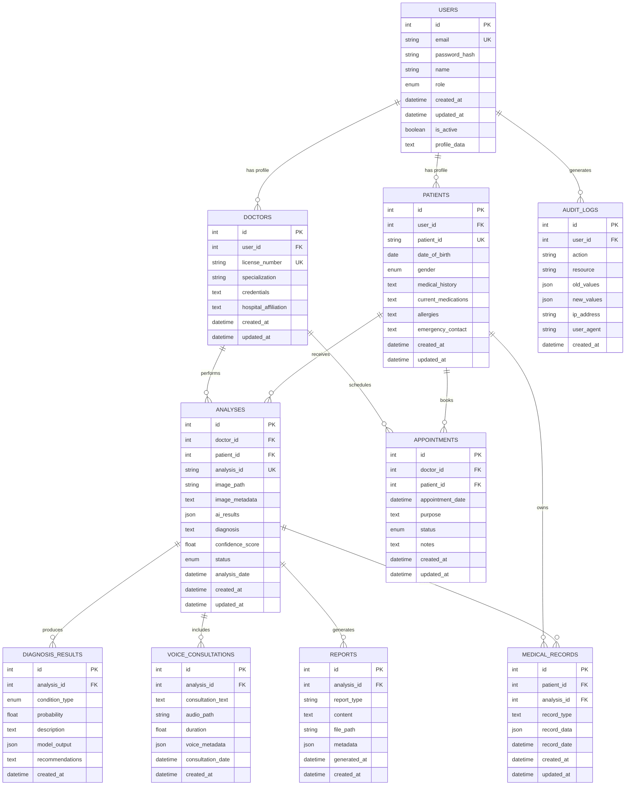

---

## 4. Application Flowchart

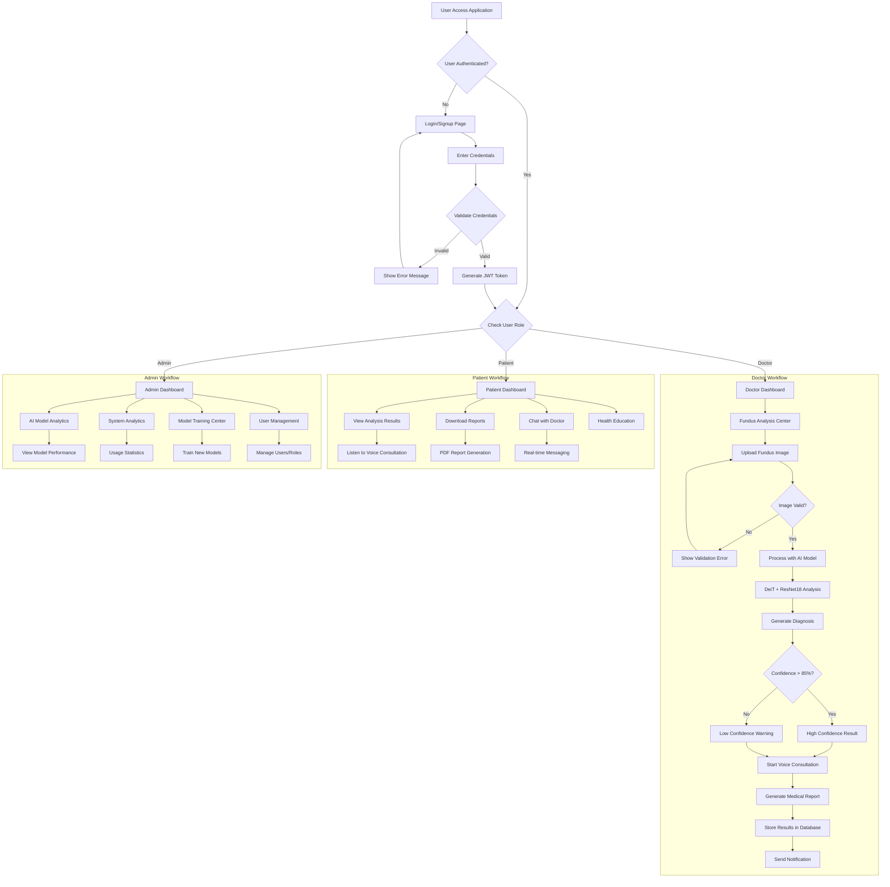

---

## 5. UML Class Diagram

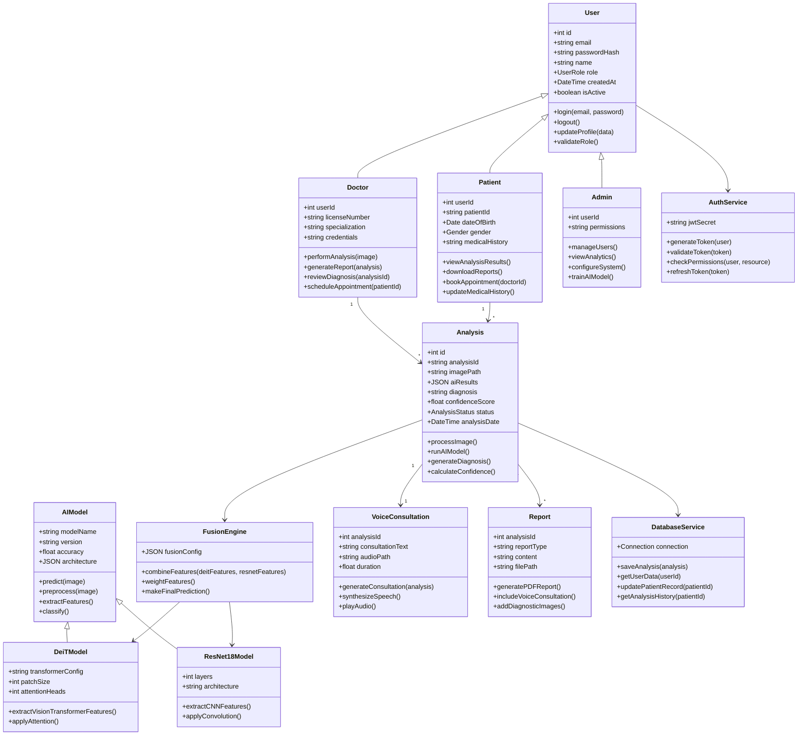

---

## 6. UML Sequence Diagram - Fundus Analysis Process

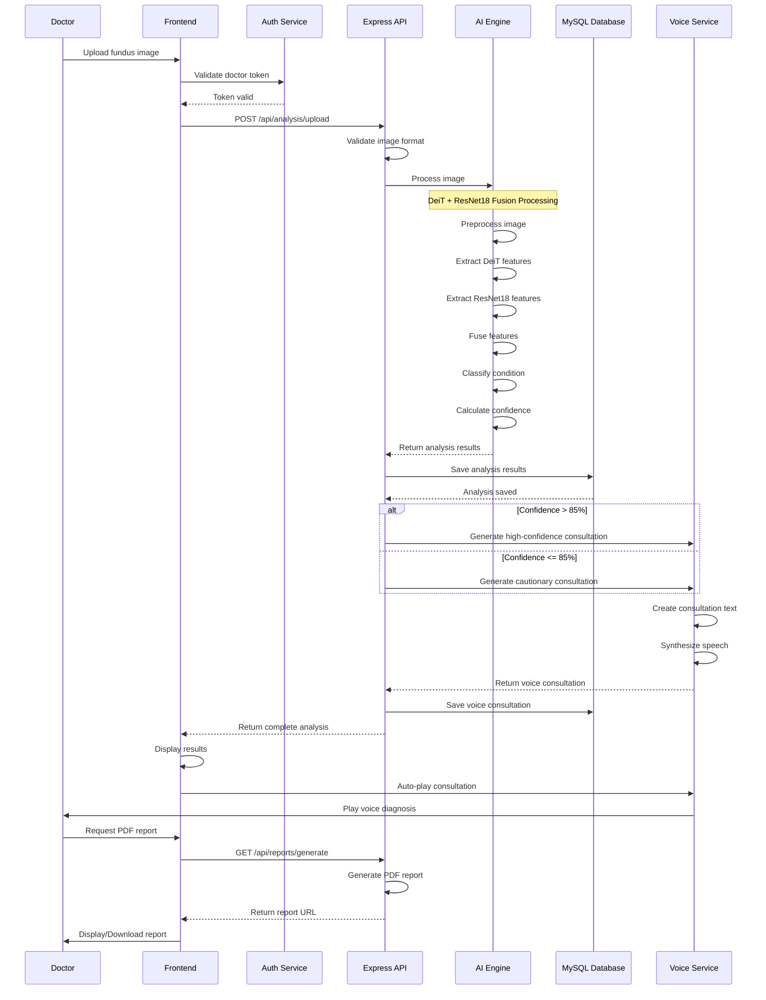

---

## 7. Component Architecture Diagram

```mermaid
graph TB
    subgraph "App.tsx - Main Application"
        A[App Component]
        B[Router Configuration]
        C[Authentication State]
        D[Global State Management]
    end
    
    subgraph "Authentication Components"
        E[LoginPage]
        F[SignupPage]
        G[ProtectedRoute]
        H[AuthService]
    end
    
    subgraph "Doctor Components"
        I[DoctorDashboard]
        J[FundusAnalysis]
        K[AnalysisCenter]
        L[AIAssistant]
        M[VoiceControlPanel]
        N[MedicalReports]
        O[PatientChat]
        P[AppointmentManagement]
        Q[DiagnosticResults]
        R[EmailCenter]
    end
    
    subgraph "Patient Components"
        S[PatientDashboard]
        T[UserReports]
        U[ChatWithDoctor]
        V[HealthEducation]
        W[DownloadCenter]
    end
    
    subgraph "Admin Components"
        X[AdminDashboard]
        Y[AIModelCenter]
        Z[AnalyticsDashboard]
        AA[AIModelAnalytics]
        BB[ModelArchitecture]
        CC[TrainingControls]
        DD[TrainingProgress]
    end
    
    subgraph "Shared UI Components"
        EE[Card Components]
        FF[Button Components]
        GG[Form Components]
        HH[Chart Components]
        II[Navigation Components]
        JJ[Alert Components]
    end
    
    subgraph "Services Layer"
        KK[AuthService]
        LL[MySQLService]
        MM[VoiceService]
        NN[DataStore]
    end
    
    A --> B
    A --> C
    A --> D
    B --> E
    B --> F
    B --> G
    C --> H
    
    G --> I
    I --> J
    I --> K
    I --> L
    I --> M
    I --> N
    I --> O
    I --> P
    I --> Q
    I --> R
    
    G --> S
    S --> T
    S --> U
    S --> V
    S --> W
    
    G --> X
    X --> Y
    X --> Z
    X --> AA
    Y --> BB
    Y --> CC
    Y --> DD
    
    A --> EE
    A --> FF
    A --> GG
    A --> HH
    A --> II
    A --> JJ
    
    A --> KK
    A --> LL
    A --> MM
    A --> NN
```

---

## 8. Database Schema Relationships

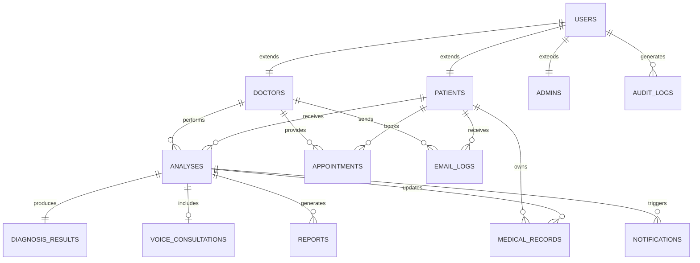

---

## 9. AI Model Architecture Flow

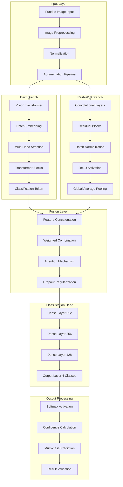

---

## 10. Voice Consultation System Flow

```mermaid
stateDiagram-v2
    [*] --> AnalysisComplete
    AnalysisComplete --> TextGeneration : Generate consultation text
    TextGeneration --> ContentValidation : Validate medical content
    ContentValidation --> ContentValidation : Content validation failed
    ContentValidation --> SpeechSynthesis : Content validated
    SpeechSynthesis --> AudioProcessing : Generate audio
    AudioProcessing --> QualityCheck : Check audio quality
    QualityCheck --> SpeechSynthesis : Quality insufficient
    QualityCheck --> AudioStorage : Quality approved
    AudioStorage --> VoicePlayback : Store and prepare playback
    VoicePlayback --> UserInteraction : Auto-play to user
    UserInteraction --> VoicePlayback : User replays
    UserInteraction --> ConsultationComplete : User stops
    ConsultationComplete --> [*]
    
    note right of TextGeneration : Generate essential diagnostic info\nTarget: <60 seconds
    note right of SpeechSynthesis : Speech rate: 1.3x speed\nVoice: Professional medical tone
    note right of UserInteraction : Only stop button available\nNo pause/rewind controls
```

---

## 11. Authentication & Authorization Flow

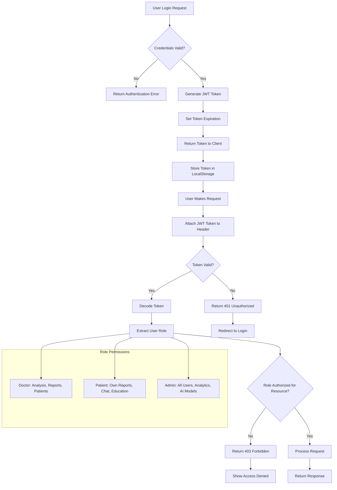

---

## 12. System Deployment Architecture

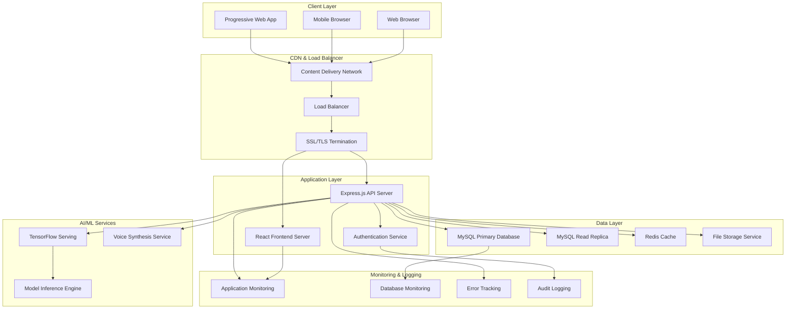

---

## Technical Implementation Notes

### Database Considerations
- **Primary Key Strategy**: Auto-incrementing integers for performance
- **Foreign Key Constraints**: Enforced for data integrity
- **Indexing**: Optimized for common query patterns
- **Audit Trail**: Complete logging of all medical data changes

### Security Measures
- **JWT Authentication**: Stateless token-based auth
- **Role-Based Access Control**: Granular permissions
- **Data Encryption**: At rest and in transit
- **HIPAA Compliance**: Medical data protection standards

### Performance Optimizations
- **Database Connection Pooling**: Efficient MySQL connections
- **Redis Caching**: Fast access to frequently used data
- **Image Optimization**: Compressed storage and processing
- **Lazy Loading**: On-demand component loading

### AI Model Integration
- **Model Versioning**: Track and deploy model updates
- **A/B Testing**: Compare model performance
- **Fallback Mechanisms**: Graceful degradation
- **Confidence Thresholds**: Quality assurance for predictions

### Voice System Architecture
- **Real-time Generation**: On-demand voice synthesis
- **Medical Vocabulary**: Specialized pronunciation
- **Quality Control**: Audio validation pipeline
- **Accessibility**: WCAG 2.1 AA compliance

---

*This documentation provides a comprehensive view of the Retinal-AI system architecture and can be used for development, maintenance, and system understanding purposes.*